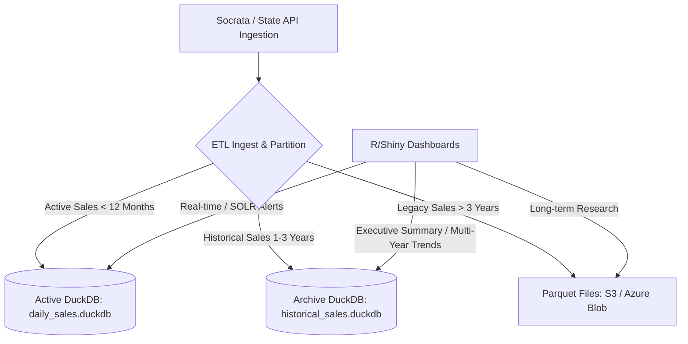

# Stochos — Analytical Database Scaling Roadmap

**Last Updated:** 2026-05-26  
**Status:** Draft / Architectural Strategy  
**Purpose:** Outlines the strategy for scaling Stochos' analytical data layer (DuckDB) as lottery sales history, geographic records, and daily transaction details grow to enterprise scale.

---

## The Scale Challenge
Lottery time-series transaction data grows rapidly. In a single state (like New York) with ~15,000 retailers and multiple games:
*   **Daily sales (wide format):** ~5.5 million rows per year.
*   **Melted daily sales (long format by game):** ~80 million rows per year.
*   **3 Years of history:** ~240 million rows (~4 GB compressed in DuckDB).
*   **Adding more jurisdictions:** Scaling to 5+ states will push volume past **1 billion rows** within 2–3 years.

To prevent query degradation, memory exhaustion, and server resource contention, Stochos will implement a tiered storage and database partitioning strategy.

---

## Proposed Architecture: Tiered Analytical Storage



### 1. Active Database Windowing (12-Month Constraint)
*   **Strategy:** Constrain the primary, low-latency DuckDB file (`daily_sales_active.duckdb`) to a rolling **12-month window** of daily retailer transactions.
*   **Use Case:** Serves the **Spatial Operations, Logistics & Risk (SOLR)**, recent performance ranking, map display overlays, and immediate forecasting engines.
*   **Benefit:** Keeps the active database size under **1 GB**, ensuring dashboard aggregations take less than 50ms and fit comfortably within container RAM limits.

### 2. Multi-DuckDB Segmentation (Load Offloading)
*   **Strategy:** Spin up isolated, domain-specific DuckDB database files instead of a single monolith.
*   **Segmentation Axes:**
    *   **Jurisdiction Segmentation:** Maintain one DuckDB file per state (e.g., `ny_sales.duckdb`, `tx_sales.duckdb`). This prevents locks in one state from blocking analytical workloads in another.
    *   **Operational Segmentation:** Separate the **FOMO/Retailer Audit** logs from **Sales Transactions**. For example, a dedicated `crm_audit.duckdb` can track retailer verifications and geocoding histories.
    *   **Budgeting/Planning Simulation:** Keep user-generated plan daily series in a temporary sandbox DuckDB file, synced only on demand.

### 3. Historical Archiving via Parquet (1–3 Years)
*   **Strategy:** Data older than 12 months is migrated to a historical database, and data older than 3 years is exported to compressed **Apache Parquet** files.
*   **Storage Location:** Local archive folder for development; AWS S3, Google Cloud Storage, or Azure Blob for production.
*   **Query Mechanism:** DuckDB's native HTTP/S3 filesystem extension can run fast SQL queries directly on top of these Parquet files without importing them.
*   **Example Query:**
    ```sql
    -- Query 2023 historical data directly from cloud storage
    SELECT county, SUM(amount) 
    FROM read_parquet('s3://stochos-archives/ny/sales/year=2023/*.parquet')
    GROUP BY county;
    ```

---

## Implementation Roadmap & Action Items

### Phase 1: Ingestion Partitioning & Active Windowing (Near-Term)
*   [ ] **Modify ETL Ingest:** Update `ny_duckdb_refresh.py` (and corresponding python scripts) to write to two destinations:
    *   `daily_sales_active.duckdb` (keeps rolling 365 days of data).
    *   `daily_sales_archive.duckdb` (keeps the full historical sequence).
*   [ ] **Dashboard Source Selection:** Update R/Shiny connection logic to read from `daily_sales_active.duckdb` for SOLR/Map views, and only query `daily_sales_archive.duckdb` if the user selects a date range extending beyond 12 months.

### Phase 2: Parquet Archiving Pipeline (Mid-Term)
*   [ ] **Write Archive Script:** Build a python script (`archive_old_data.py`) that exports records older than 3 years from DuckDB to partitioned Parquet files (e.g., partitioned by `/year=YYYY/month=MM/`).
*   [ ] **Establish Clean-up Routine:** Add a cleanup step in the database refresh jobs to purge records older than 3 years from the local DuckDB files once the Parquet export is verified.

### Phase 3: Cloud Storage Integration (GA / Production)
*   [ ] **Setup Cloud Buckets:** Deploy secure S3/Blob storage buckets for historical Parquet logs.
*   [ ] **Integrate DuckDB S3 Extension:** Configure the R/Shiny production container with read-only AWS/GCS credentials and configure DuckDB to resolve historical queries using the cloud storage endpoint.
