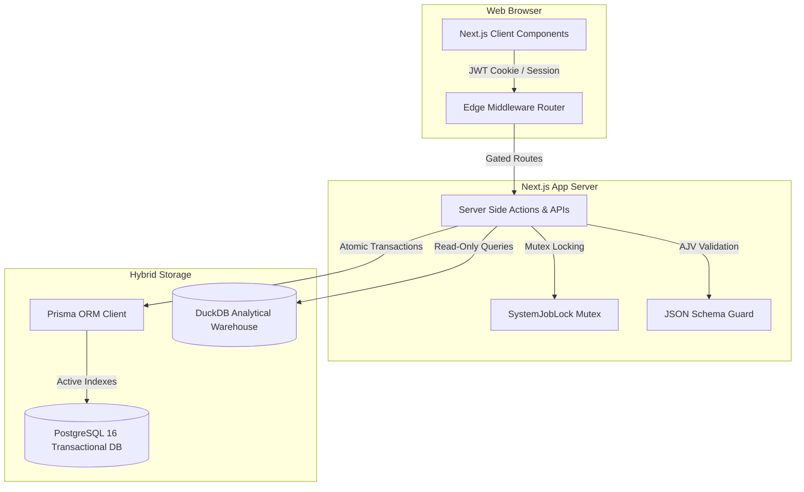

# Stochos Platform

## Enterprise Architecture & Security Whitepaper

**Version:** 2.0  
**Audience:** Enterprise IT Directors, Security Officers, Database Architects, Finance Executives, Procurement Teams, and Government Technology Review Boards

---

# Executive Summary

Stochos is a modular enterprise operations platform designed specifically for government agencies, state lotteries, and public-sector organizations that require strong financial controls, operational transparency, and audit-ready governance.

Traditional enterprise systems often separate operational workflows, financial oversight, field operations, reporting, and analytics into disconnected software products. These fragmented environments increase implementation costs, create duplicate data entry, and complicate regulatory compliance.

Stochos was designed to address this challenge through a unified architecture that combines transactional operations, analytical reporting, workflow governance, and operational intelligence within a single platform.

The system emphasizes:
* **Auditability by default**
* **Modular deployment**
* **Low infrastructure requirements** (No specialized field hardware, device agents, or proprietary tracking equipment are required)
* **Accessibility compliance**
* **Security-first architecture**
* **Separation of operational and analytical workloads**

The result is a platform capable of supporting contract management, marketing operations, asset tracking, financial administration, retailer relationship management, and executive reporting while maintaining clear governance boundaries and operational accountability.

---

# Architectural Principles

The Stochos architecture is governed by four foundational principles.

## Principle 1: Auditability by Default
Every meaningful business action should be traceable. Contract modifications, approval decisions, user permission changes, financial adjustments, and administrative actions are recorded through structured audit events. The platform is designed to support internal control reviews, operational investigations, and external compliance audits without requiring additional software tools.

## Principle 2: Separation of Operational and Analytical Workloads
Operational systems and analytical systems serve different purposes. Operational systems prioritize transactional integrity, concurrency, and business workflows. Analytical systems prioritize aggregation, forecasting, reporting, and historical trend analysis. Stochos intentionally separates these responsibilities to preserve performance, scalability, and data integrity.

## Principle 3: Modular Adoption
Organizations should not be required to purchase or deploy functionality they do not need. Each major capability area can be enabled independently, allowing organizations to begin with a limited implementation and expand over time.

## Principle 4: Accessibility as a Core Requirement
Accessibility is treated as an architectural requirement rather than a post-deployment enhancement. All user interfaces are designed to conform to WCAG 2.1 AA standards and support government procurement requirements across multiple jurisdictions.

---

# Platform Architecture

The platform consists of three independently governed layers.



## Application Layer
The application layer provides business workflows, user interfaces, APIs, permissions, and operational controls.
* **Technology Stack**: Next.js 16.2.6 (App Router) executing on Node.js 24 LTS, Prisma ORM.
* **Responsibilities**: Contract Management, Marketing Operations, Asset Management, User Administration, Workflow Governance, and Audit Logging.

## Transactional Data Layer
PostgreSQL 16 operates as the transactional system of record for operational data.
* **Responsibilities**: Contracts, Vendors, Campaigns, Assets, User Accounts, Permissions, and Audit Records.
* **Characteristics**: ACID-compliant transactions, relational integrity constraints, structured role-based access controls, and high-concurrency support.

## Analytical Data Layer
DuckDB operates as the analytical warehouse.
* **Responsibilities**: Historical sales data, forecasting models, retailer performance analytics, executive reporting marts, and statistical analysis.
* **Characteristics**: Columnar analytical engine, large-scale aggregation support, read-optimized architecture, and isolated reporting workloads.

No live cross-database joins are permitted between the transactional and analytical layers. Data movement occurs exclusively through governed ETL processes to prevent performance degradation of the active system of record.

---

# Security Architecture

Security controls are implemented through multiple independent layers.

## Identity & Access Management
* **SSO Federation**: Authentication is managed through industry-standard identity protocols. Supported integration patterns include SAML 2.0, OpenID Connect (OIDC), Microsoft Azure Active Directory, and Google Workspace federation for single sign-on (SSO).
* **Session Management**: Sessions are maintained through signed and encrypted HttpOnly cookies, reducing exposure to client-side script access and supporting secure session persistence.
* **Role-Based Access Control (RBAC)**: governs access to all modules, APIs, and administrative functions, validating permission settings (None, Read, Write) on every API action.

## Data Protection
* **Data in Transit**: All communications utilize TLS 1.3 encryption (with fallback support for TLS 1.2 for legacy clients) to prevent eavesdropping and man-in-the-middle attacks.
* **Data at Rest**: Database volumes, backup archives, and file storage repositories support AES-256 encrypted deployment models. PostgreSQL backups are encrypted using standard GPG/AES-256.
* **Secrets Management**: Credentials, API keys, and authentication secrets are maintained outside source code repositories using secure env parameters, managed via enterprise secrets platforms (AWS Secrets Manager, Azure Key Vault, or HashiCorp Vault) in cloud environments.
* **Concurrency Lock Safeguard**: High-impact asynchronous actions (like CSV uploads or allocations) acquire database-backed **Mutex Locks** (`SystemJobLock`). Duplicate simultaneous requests are rejected with a `429 Conflict` status, and hung locks prune automatically.

---

# Governance & Compliance

## Audit Logging
The platform maintains detailed records of:
* Data creation
* Data modification (storing old/new change diffs)
* Data deletion
* Permission changes
* Administrative actions

Audit records are preserved for operational review and compliance verification inside the system `AuditLog` table.

## Accessibility & Global Standards
The platform is designed to align with:
* WCAG 2.1 AA
* Americans with Disabilities Act (ADA)
* Section 508 of the Rehabilitation Act
* European Accessibility Act (EAA) (EN 301 549)
* Japanese Industrial Standards (JIS X 8341-3)
* India's Rights of Persons with Disabilities (RPwD) Act

## Data Governance
Business rules are enforced through:
* **Relational constraints** (e.g., assets map to a retail location OR a corporate office, but never both)
* **Validation schemas** (AJV JSON Schema validators on all API inputs)
* **Transaction boundaries** (Atomic Prisma `$transaction` rollbacks for bulk operations)
* **Workflow approval controls**

These controls reduce operational risk and help preserve data quality.

---

# Deployment Architecture

Stochos supports multiple deployment models. Supported environments include:
* **On-Premises Windows Server** (running via Docker Desktop or IIS Node configuration)
* **On-Premises Linux Server** (Ubuntu, RedHat)
* **Microsoft Azure**
* **Amazon Web Services (AWS)**
* **Google Cloud Platform (GCP)**
* **Hybrid Deployments**

### Reference Architecture (Standard Docker Blueprint)
* **Operating System**: Ubuntu 22.04 LTS (running via WSL2 in local dev, or bare-metal Linux in production).
* **Containerization**: Docker Compose orchestrating app and database services.
* **Database**: PostgreSQL 16 container.
* **App Layer**: Next.js App Server.
* **Analytics Core**: DuckDB + RStudio/Posit server running Shiny Server.

---

# Business Continuity & Recovery

The platform supports enterprise recovery strategies through:
* Scheduled database backups
* Encrypted backup archives
* Infrastructure-as-code deployment practices
* Containerized application services
* Automated recovery procedures

Recovery objectives can be configured according to organizational requirements.

---

# Capability Maturity Roadmap

Stochos maintains a formal maturity model that distinguishes between:
* **Production Capabilities**: Core systems currently deployed and operational in production.
* **Staged Capabilities**: Features implemented in Next.js but marked for staging/user acceptance verification.
* **Planned Capabilities**: Strategic roadmaps under active planning.

This approach ensures implementation status remains transparent to customers, auditors, and procurement reviewers.

```
Stochos Platform Capability Maturity Grid
──────────────────────────────────────────────────────────────────────────
[Production] Contract Management (CLM)
[Production] VCRM Retailer Registry
[Production] Preventative Maintenance Calendar
[Production] Straight-Line Financial Depreciation
[Production] Settings Presets Cockpit & Toggles
[Production] Divisional Budgeting & ACFR Proposals
[Staged]     CapEx Forecasting & Inflation Budgeting
[Staged]     Mobile Photo-Audit Snapping
[Staged]     Import Sandbox Validation Grid
[Staged]     Held-Karp Route Optimization (FOMO Planner)
[Staged]     Avery 5163 Tag Compiler
[Staged]     GASB 34 financial statements
[Roadmap]    Enterprise SSO Federation (SAML/OIDC)
[Roadmap]    XBRL Industry Standardization
[Roadmap]    AI-Driven Audit Spot-checks
[Roadmap]    Advanced Telematics OCR
──────────────────────────────────────────────────────────────────────────
```

---

# Functional Module Specifications

### 1. Governed Financial & Performance Administration (GFPA)
The GFPA module establishes an immutable data pipeline from raw file ingestion to final board presentation packets.
* **Ingest Cockpit**: Ingests monthly Trial Balance CSV files, validating double-entry balancing (total assets/liabilities must equal exactly $0.00) before allowing a period to be closed and locked.
* **Temporal Crosswalk Rules**: Maps a Chart of Accounts (COA) to system metrics using wildcard patterns (e.g., `40100-*-*-*`) and temporal start/end validity dates.
* **GASB 34 Statement Compiler `[Staged]`**: Programmatically compiles landscape, multi-page accounting statements (Net Position, Revenues/Expenses, Cash Flows) using coordinate-drawn PDF vectors, adhering to municipal auditing standards.
* **XBRL Industry Standardization `[Roadmap]`**: Standardizes output data schemas to comply with Extensible Business Reporting Language (XBRL) tags for open-government financial reporting.

### 2. Divisional Budgeting & ACFR Planning
Designed to mirror divisional general and administrative (G&A) proposals.
* **Burdened Labor Costing**: Automatically applies a standard 2.0x multiplier to base personnel wages to account for payroll taxes, health benefits, pension contributions, and state unemployment taxes (SUTA).
* **Cap Validation checks**: Validates divisional budget submissions against Dob (Department of Budget) caps, triggering real-time validation highlights if spending limits are exceeded.
* **Compilation Rollup**: Finance administrators compile approved division proposals to write consolidated master ledger rows dynamically.

### 3. VCRM Operations (Visitations, Coaching & Relationship Management)
Coordinates rep schedules, store audits, and field routing optimization.
* **Geocoded Route Optimization (FOMO Planner) `[Staged]`**: Solves the Travelling Salesperson Problem (TSP) using Held-Karp and 2-opt algorithms. It queries real road distances via an OSRM routing engine, falling back to Haversine trigonometry when network limits occur.
* **Proximity Snap Alignment `[Staged]`**: Resolves phone GPS drift by querying the database for CRM store coordinates within 500 meters of the rep, snapping photo-audit uploads to official locations.
* **Duplicate & Recount Protection `[Staged]`**: Exif headers are parsed to check file sizes, creation timestamps, and file signatures. Uploading the same image file twice or submitting multiple audits in the same wave is blocked.

### 4. Contract Management
Tracks legal agreements, spent thresholds, and document compliance.
* **Spent Ceilings & PO Auditing**: Links purchase orders (PO) to contracts, calculating spent percentages in real-time and warning administrators as allocations approach contract caps.
* **Row-Level Contract Sharing**: Secure file access controls allow contract owners to share read/write permissions with specific users, keeping non-authorized users locked out of sensitive legal files.
* **Compliance Gates**: Tracks milestones and audit log histories, saving old/new value diffs, actor emails, and timestamps.

### 5. Fleet & Asset Management
Combines physical device tracking and vehicle operations into a unified registry.
* **Import Sandbox View `[Staged]`**: Isolates bulk uploads, rendering cell-level errors in red (⚠️). Inline spreadsheet editing allows administrators to correct typos in categories or location codes and re-validate locally before database commit.
* **Dynamic Inflation Forecasting `[Staged]`**: Compounds lifecycle replacement budgets over a 10-year timeline using \(Cost \times (1 + r)^n\), calculating duration \(n\) from the asset's purchase year to its projected EOL year.
* **Straight-Line Depreciation**: Computes monthly depreciation values based on acquisition price, expected salvage value, and useful life span.
* **Avery 5163 Tag Compiler `[Staged]`**: Generates printable Code 39 barcode labels drawn via PDFKit vector geometry, preventing scanner failures.
* **Odometer Compliance Loop `[Staged]`**: Drivers scan dashboard QR codes to submit odometer readings and pre-trip checklists. If logs are missing for 3 days, escalation alerts are flagged on the Fleet Manager's dashboard, with a "Copy to Clipboard" button to notify supervisors via Teams/Slack.

### 6. Instant Ticket Working Papers & Prize Structures
Integrates sandbox planning models with legal contracts and official prize payout specifications.
* **1-to-1 Relational Integrity**: Establishes a strict 1-to-1 connection between planned scenario games (`InstantTicketGame`) and executed contracts (`InstantTicketWorkingPaper`). Database foreign key constraints employ `onDelete: SetNull` cascade policies so that if a sandbox plan is deleted or re-seeded, the historical co-signed working paper remains archived in the system of record.
* **Atomic Save Transactions (`$transaction`)**: Modifying prize grid structures triggers an atomic PostgreSQL transaction. The engine deletes old tiers, validates input structures, creates new rows, and recalculates parent parameters (overall odds, total prize expense) in a single block. A failure in any row immediately rolls back all changes, protecting the database from corrupted or orphaned allocations.
* **Statutory Compliance Checkers**: The balancer enforces retail cashability compliance (alerting if prizes cashable at retail under $600 fall below a 75% target) and highlights claim-only W-2G tax limits (flagging tiers at $600+).
* **Dynamic Relational Pre-filling**: Associating a working paper with a planned scenario game automatically pre-fills game parameters (denomination, print run size, and titles) directly from the active plan, aligning procurement records.
* **Tiptap Legal Document Compiler**: Storing rich-text HTML validation procedures and play style rules directly in the database, allowing users to compile and co-sign formal agreements via an inline WYSIWYG editor.
* **Bidirectional Sandbox Sync**: Saving calculated payout overrides automatically synchronizes the data model back to the planning sandbox, updating Gantt calendar lifespans, central overhead allocations, and margin sliders in real-time.

---

# Conclusion

Stochos was designed to provide government organizations with a secure, auditable, and operationally efficient alternative to fragmented administrative systems.

By separating transactional and analytical workloads, enforcing governance controls, maintaining accessibility compliance, and supporting modular deployment, the platform enables organizations to modernize operations without sacrificing accountability, security, or transparency.

The platform's architecture reflects a simple objective: Provide enterprise-grade operational intelligence while preserving the governance standards required by public-sector institutions.
