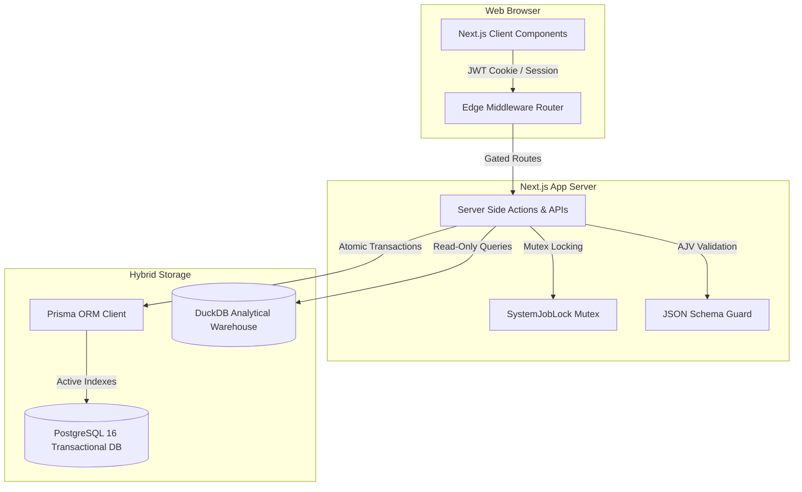

# Stochos Platform: Technical Architecture & Security Whitepaper

**Document Version:** 1.2.0  
**Target Audience:** Enterprise IT Directors, Security Officers, Database Architects, and Procurement Reviewers  
**Subject System:** Stochos Lottery Business Platform (v0.2.0)

---

## Executive Summary

Stochos is a modular, high-performance business administration platform designed for state lottery agencies and municipal finance operations. The platform operates on a **low-infrastructure model**, designed to streamline corporate and retail operations without requiring the deployment of specialized field hardware, device agents, or proprietary tracking equipment.

By combining standard web protocols, mobile-based metadata checks, in-browser EXIF GPS parsing, and relational database constraints, Stochos delivers enterprise-grade operational controls, financial audits, and route optimization.

---

## Part 1: Platform-Level Architecture

The platform layer establishes the core infrastructure, runtime boundaries, shared database layers, global security systems, and administrative identity controls.

### 1.1 Core Runtime & Infrastructure
* **Runtime Framework**: Next.js 16.2.6 (App Router) executing on Node.js 24 LTS.
* **Build Engine**: Next.js Turbopack compiler (optimized client bundles with dead-code elimination).
* **Database Layer**: PostgreSQL 16 (transactional) and DuckDB (analytical).
* **Object Relational Mapper (ORM)**: Prisma 7.8.0 leveraging the `PrismaPg` native driver adapter.

### 1.2 Shared Identity, Session & RBAC
* **Session Management**: NextAuth v5 (Beta 31) using secure JSON Web Tokens (JWT) for session persistence. Sessions are maintained through signed and encrypted HttpOnly cookies, reducing exposure to client-side script access and supporting secure session persistence.
* **Enterprise Authentication (SSO Federation)**: The authentication layer is designed to integrate with corporate directories, supporting SAML 2.0, OpenID Connect (OIDC), Azure Active Directory (AD), and Google Workspace federation for single sign-on (SSO).
* **Route Protection (Edge Middleware)**: A centralized `middleware.js` intercepts all browser page routing. It parses the active JWT and redirects unauthorized attempts to `/login` or `/unauthorized` before page rendering begins.
* **Granular Role-Based Access Control (RBAC)**: Stochos supports modular permission configurations. Roles (such as `admin`, `it_manager`, `analyst`, `procurement_officer`) carry specific access metrics (None, Read, Write) across individual system modules, which are validated server-side on every API action.

### 1.3 Platform Security & Secrets Management
* **Data-in-Transit Encryption**: All network traffic is encrypted using TLS 1.3 (with fallback to TLS 1.2 for legacy clients) to prevent eavesdropping and man-in-the-middle attacks.
* **Data-at-Rest Encryption**: Database volumes and file storage systems are encrypted using AES-256. PostgreSQL backups are encrypted using standard GPG/AES-256 before being written to secure storage objects.
* **Secrets Management**: All database credentials, OAuth client secrets, API keys, and environment-specific parameters are stored outside the code repository using encrypted environment variables. In production environments, these are managed using enterprise secrets managers (such as AWS Secrets Manager, Azure Key Vault, or HashiCorp Vault).
* **Prevention of Injection Attacks**: Prisma ORM executes parameterized SQL queries natively. User inputs are never concatenated directly into raw database commands, neutralizing SQL injection vulnerabilities.
* **Input Validation Schemas**: Incoming API request payloads are validated using **AJV JSON Schema Validation** (`ajv` and `ajv-formats`). Payloads violating structure constraints are aborted prior to database insertion.
* **Mutex Concurrency Locks (Race-Condition Protection)**: High-impact asynchronous background tasks (like Trial Balance CSV uploads or bulk allocations) are protected by a database-backed **Mutex Lock** (`SystemJobLock`).
    - Simultaneous requests for the same action key are rejected with a `429 Conflict` status.
    - Stale or interrupted locks are automatically pruned using a 120-second timeout trigger.
* **Buffer-Exhaustion Protection (DoS)**: Stream parsers (`busboy`) validate file upload sizes on-the-fly. Connections are instantly closed if client uploads exceed **5MB**, protecting the single-threaded Node process from memory exhaustion.
* **Platform-Wide Auditing**: All create, update, delete, and permission change events are recorded in immutable audit records inside the system `AuditLog` table. This provides a clear, queryable audit trail for corporate and government compliance reviews.

### 1.4 Data Integrity & Database Performance
* **Atomic Database Transactions (`$transaction`)**: Every bulk operation executes inside an atomic write block. If any single data record fails validation or the server loses connection midway, **the entire transaction rolls back**, ensuring no partial, corrupt data remains.
* **Relational Mutual Exclusion**: Strict schema-level constraints enforce logical business rules (e.g., an asset can belong to a retail location OR a corporate office, but never both simultaneously), preventing ledger contradictions.
* **Query Performance Scaling**: Indexes are applied to frequently queried columns (including `status`, `category`, `deploymentType`, `retailerId`, and `orgUnitId`) to maintain performant query execution as data volumes scale.

### 1.5 Data Architecture (Hybrid Transactional/Analytical Model)
Stochos enforces a clean separation of concerns by deploying a hybrid database model, ensuring transactional operations never collide with heavy analytical reporting:

* **Transactional Layer (PostgreSQL 16)**: Operates as the transactional system of record. Manages structured, operational tables including Contracts, Campaigns, Vendors, Users, Assets, and Audit logs.
* **Analytical Layer (DuckDB)**: Operates as the analytical data warehouse. Manages large-scale datasets, including lottery sales facts, historical retailer dimensions, EOL forecasting models, and pre-computed dashboard marts.
* **Governance Principle**: *No live cross-database joins are permitted*. Data movement between the transactional and analytical layers occurs through controlled, scheduled ETL (Extract, Transform, Load) processes to prevent performance degradation of the active system of record.

### 1.6 Accessibility & Global Compliance
Accessibility and regulatory compliance are treated as core architectural parameters rather than secondary styling considerations:
* **WCAG 2.1 AA Compliance**: All client-side components utilize semantic HTML5 tags, screen-reader aria attributes, and keyboard focus indicators. Colors conform to minimum contrast ratio guidelines (4.5:1 for normal text).
* **Global Accessibility Standards**: The user interface is designed to comply with standard government procurement guidelines, including the Americans with Disabilities Act (ADA), Section 508 of the Rehabilitation Act, the European Accessibility Act (EAA) (EN 301 549), and international standards (JIS X 8341-3, India's RPwD Act).

### 1.7 Deployment Models
Stochos supports flexible, decoupled deployment topologies:
* **Supported Platforms**: 
    - *On-Premises*: Windows Server (running via Docker Desktop or IIS Node configuration) or Linux Server (Ubuntu, RedHat).
    - *Cloud Environments*: Amazon Web Services (AWS), Microsoft Azure, Google Cloud Platform (GCP), or hybrid cloud setups.
* **Reference Architecture (Standard WSL2/Docker Blueprint)**:
    - **Operating System**: Ubuntu 22.04 LTS (running via WSL2 in local dev, or bare-metal Linux in production).
    - **Containerization**: Docker Compose orchestrating the application node and database services.
    - **Database**: PostgreSQL 16 container.
    - **App Layer**: Next.js App Server.
    - **Analytics Core**: DuckDB + RStudio/Posit server running Shiny Server.

---

## Part 2: Functional System Modules

Stochos organizes business operations into functional, decoupled modules. The following maturity table illustrates the current implementation status of the platform capabilities:

### 2.0 Capability Maturity Table

| Capability / Feature Area | Scope / Module | Status | Classification |
| :--- | :--- | :--- | :--- |
| **Contract Lifecycle Management (CLM)** | Contract Management | **Production** | Current Core System |
| **VCRM Retailer Registry** | VCRM Operations | **Production** | Current Core System |
| **Preventative Maintenance Calendar** | Fleet & Asset Management | **Production** | Current Core System |
| **Straight-Line Financial Depreciation** | Fleet & Asset Management | **Production** | Current Core System |
| **Settings Presets Cockpit** | System Settings | **Production** | Current Core System |
| **Avery 5163 Tag Compiler** | Fleet & Asset Management | **Staged** | In Development |
| **Mobile Photo-Audit Snapping** | VCRM Operations | **Staged** | In Development |
| **Odometer Compliance Alerts** | Fleet & Asset Management | **Staged** | In Development |
| **CapEx Forecasting & Inflation** | Fleet & Asset Management | **Staged** | In Development |
| **Held-Karp Route Optimization** | VCRM (FOMO Planner) | **Staged** | In Development |
| **GASB 34 financial statements** | GFPA Reporting | **Staged** | In Development |
| **XBRL Industry Standardization** | GFPA Reporting | **Roadmap** | Planned Capability |
| **AI-Driven Audit Spot-checks** | VCRM Operations | **Roadmap** | Planned Capability |
| **Advanced Telematics OCR** | Fleet & Asset Management | **Roadmap** | Planned Capability |

---

### 2.1 Governed Financial & Performance Administration (GFPA)
The GFPA module establishes an immutable data pipeline from raw file ingestion to final board presentation packets.
* **Ingest Cockpit**: Ingests monthly Trial Balance CSV files, validating double-entry balancing (total assets/liabilities must equal exactly $0.00) before allowing a period to be closed and locked.
* **Temporal Crosswalk Rules**: Maps a Chart of Accounts (COA) to system metrics using wildcard patterns (e.g., `40100-*-*-*`) and temporal start/end validity dates.
* **GASB 34 Statement Compiler `[Staged]`**: Programmatically compiles landscape, multi-page accounting statements (Net Position, Revenues/Expenses, Cash Flows) using coordinate-drawn PDF vectors, adhering to municipal auditing standards.
* **XBRL Industry Standardization `[Roadmap]`**: Standardizes output data schemas to comply with Extensible Business Reporting Language (XBRL) tags for open-government financial reporting.

### 2.2 Divisional Budgeting & ACFR Planning
Designed to mirror divisional general and administrative (G&A) proposals.
* **Burdened Labor Costing**: Automatically applies a standard 2.0x multiplier to base personnel wages to account for payroll taxes, health benefits, pension contributions, and state unemployment taxes (SUTA).
* **Cap Validation checks**: Validates divisional budget submissions against Dob (Department of Budget) caps, triggering real-time validation highlights if spending limits are exceeded.
* **Compilation Rollup**: Finance administrators compile approved division proposals to write consolidated master ledger rows dynamically.

### 2.3 VCRM Operations (Visitations, Coaching & Relationship Management)
Coordinates rep schedules, store audits, and field routing optimization.
* **Geocoded Route Optimization (FOMO Planner) `[Staged]`**: Solves the Travelling Salesperson Problem (TSP) using Held-Karp and 2-opt algorithms. It queries real road distances via an OSRM routing engine, falling back to Haversine trigonometry when network limits occur.
* **Proximity Snap Alignment `[Staged]`**: Resolves phone GPS drift by querying the database for CRM store coordinates within 500 meters of the rep, snapping photo-audit uploads to official locations.
* **Duplicate & Recount Protection `[Staged]`**: Exif headers are parsed to check file sizes, creation timestamps, and file signatures. Uploading the same image file twice or submitting multiple audits in the same wave is blocked.

### 2.4 Contract Management
Tracks legal agreements, spent thresholds, and document compliance.
* **Spent Ceilings & PO Auditing**: Links purchase orders (PO) to contracts, calculating spent percentages in real-time and warning administrators as allocations approach contract caps.
* **Row-Level Contract Sharing**: Secure file access controls allow contract owners to share read/write permissions with specific users, keeping non-authorized users locked out of sensitive legal files.
* **Compliance Gates**: Tracks milestones and audit log histories, saving old/new value diffs, actor emails, and timestamps.

### 2.5 Fleet & Asset Management
Combines physical device tracking and vehicle operations into a unified registry.
* **Import Sandbox View**: Isolates bulk uploads, rendering cell-level errors in red (⚠️). Inline spreadsheet editing allows administrators to correct typos in categories or location codes and re-validate locally before database commit.
* **Dynamic Inflation Forecasting `[Staged]`**: Compounds lifecycle replacement budgets over a 10-year timeline using \(Cost \times (1 + r)^n\), calculating duration \(n\) from the asset's purchase year to its projected EOL year.
* **Straight-Line Depreciation**: Computes monthly depreciation values based on acquisition price, expected salvage value, and useful life span.
* **Avery 5163 Tag Compiler `[Staged]`**: Generates printable Code 39 barcode labels drawn via PDFKit vector geometry, preventing scanner failures.
* **Odometer Compliance Loop `[Staged]`**: Drivers scan dashboard QR codes to submit odometer readings and pre-trip checklists. If logs are missing for 3 days, escalation alerts are flagged on the Fleet Manager's dashboard, with a "Copy to Clipboard" button to notify supervisors via Teams/Slack.

### 2.6 Administrative System Settings
* **Toggles Grid**: Enables/disables individual functional modules on-the-fly.
* **Sales Presets**: Configures instant trial profiles (e.g. *Full Platform Suite*, *Finance Only*, *Operations Only*, *Minimalist Trial*) to control module availability.
