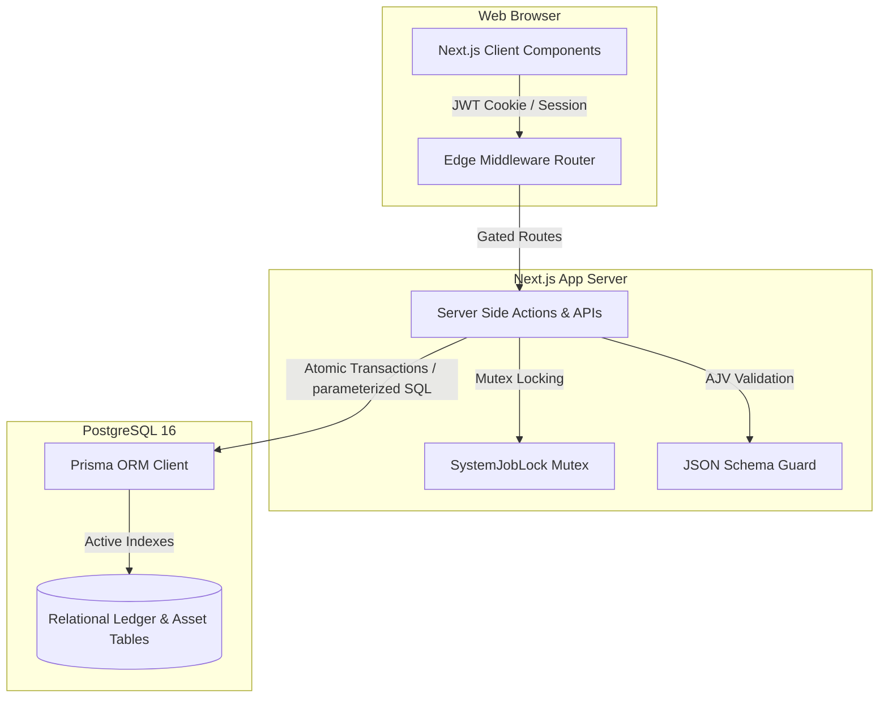

# Stochos Platform: Technical Architecture & Security Whitepaper

**Document Version:** 1.1.0  
**Target Audience:** Enterprise IT Directors, Security Officers, Database Administrators, and Procurement Reviewers  
**Subject System:** Stochos Lottery Business Platform (v0.2.0)

---

## Executive Summary

Stochos is a modular, high-performance business administration platform designed for state lottery agencies and municipal finance operations. Unlike legacy systems that require heavy, agent-based software installations on physical remote devices (e.g., lottery terminals, retail vending systems, signage), Stochos utilizes a **best-in-class, low-infrastructure model**.

By combining modern web protocols, mobile-based metadata verification, in-browser EXIF GPS parsing, dynamic receipt OCR, and relational database constraints, Stochos delivers enterprise-grade operational controls and financial audits at **zero hardware footprint** and **zero licensing overhead for external trackers**.

---

## Part 1: Platform-Level Architecture

The platform layer establishes the core infrastructure, runtime boundaries, shared database layers, global security systems, and administrative identity controls.

### 1.1 Core Runtime & Infrastructure
* **Runtime Framework**: Next.js 16.2.6 (App Router) executing on Node.js 24 LTS.
* **Build Engine**: Next.js Turbopack compiler (optimized client bundles with dead-code elimination).
* **Database Layer**: PostgreSQL 16 (relational database).
* **Object Relational Mapper (ORM)**: Prisma 7.8.0 leveraging the `PrismaPg` native driver adapter.

### 1.2 Shared Identity, Session & RBAC
* **Session Management**: NextAuth v5 (Beta 31) using secure JSON Web Tokens (JWT) for session persistence. Sessions are secured via encrypted, client-side HttpOnly cookies, guarding against Cross-Site Scripting (XSS) session hijacking.
* **Route Protection (Edge Middleware)**: A centralized `middleware.js` intercepts all browser page routing. It parses the active JWT and redirects unauthorized attempts to `/login` or `/unauthorized` before page rendering begins.
* **Granular Role-Based Access Control (RBAC)**: Stochos supports modular permission configurations. Roles (such as `admin`, `it_manager`, `analyst`, `procurement_officer`) carry specific access metrics (None, Read, Write) across individual system modules, which are validated server-side on every API action.

### 1.3 Platform Security & Defense Safeguards
* **SQL Injection Prevention**: Prisma ORM executes parameterized SQL queries natively. User inputs are never concatenated directly into raw database commands, neutralizing SQL injection vulnerabilities.
* **Input Validation Schemas**: Incoming API request payloads are validated using **AJV JSON Schema Validation** (`ajv` and `ajv-formats`). Payloads violating structure constraints are aborted prior to database insertion.
* **Mutex Concurrency Locks (Race-Condition Protection)**: High-impact asynchronous background tasks (like Trial Balance CSV uploads or bulk allocations) are protected by a database-backed **Mutex Lock** (`SystemJobLock`).
    - Simultaneous requests for the same action key are rejected with a `429 Conflict` status.
    - Stale or interrupted locks are automatically pruned using a 120-second timeout trigger.
* **Buffer-Exhaustion Protection (DoS)**: Stream parsers (`busboy`) validate file upload sizes on-the-fly. Connections are instantly closed if client uploads exceed **5MB**, protecting the single-threaded Node process from memory exhaustion.

### 1.4 Data Integrity & Relational Safety
* **Atomic Database Transactions (`$transaction`)**: Every bulk operation executes inside an atomic write block. If any single data record fails validation or the server loses connection midway, **the entire transaction rolls back**, ensuring no partial, corrupt data remains.
* **Relational Mutual Exclusion**: Strict schema-level constraints enforce logical business rules (e.g., an asset can belong to a retail location OR a corporate office, but never both simultaneously), preventing ledger contradictions.
* **Database Column Indexing**: To maintain sub-millisecond query performance on tables exceeding **45,000+ rows**, active database indexes (`@@index`) are placed on highly queried columns, including `status`, `category`, `deploymentType`, `retailerId`, and `orgUnitId`.

---

## Part 2: Functional System Modules

Stochos organizes business operations into functional, decoupled modules. If a partner disables a module via administrative toggles, the system degrades gracefully, hiding relevant UI tabs and replacing active database dropdowns with generic text backups.

### 2.1 Governed Financial & Performance Administration (GFPA)
The GFPA module establishes an immutable data pipeline from raw file ingestion to final board presentation packets.
* **Ingest Cockpit**: Ingests monthly Trial Balance CSV files, validating double-entry balancing (total assets/liabilities must equal exactly $0.00) before allowing a period to be closed and locked.
* **Temporal Crosswalk Rules**: Maps a dynamic Chart of Accounts (COA) to system metrics using wildcard patterns (e.g., `40100-*-*-*`) and temporal start/end validity dates.
* **GASB 34 Statement Compiler**: Programmatically compiles landscape, multi-page accounting statements (Net Position, Revenues/Expenses, Cash Flows) using coordinate-drawn PDF vectors, adhering to municipal auditing standards.

### 2.2 Divisional Budgeting & ACFR Planning
Designed to mirror divisional general and administrative (G&A) proposals.
* **Burdened Labor Costing**: Automatically applies a standard 2.0x multiplier to base personnel wages to account for payroll taxes, health benefits, pension contributions, and state unemployment taxes (SUTA).
* **Cap Validation checks**: Validates divisional budget submissions against Dob (Department of Budget) caps, triggering real-time validation highlights if spending limits are exceeded.
* **Compilation Rollup**: Finance administrators compile approved division proposals to write consolidated master ledger rows dynamically.

### 2.3 VCRM Operations (Visitations, Coaching & Relationship Management)
Coordinates rep schedules, store audits, and field routing optimization.
* **Geocoded Route Optimization (FOMO Planner)**: Solves the Travelling Salesperson Problem (TSP) using Held-Karp and 2-opt algorithms. It queries real road distances via an OSRM routing engine, falling back to Haversine trigonometry when network limits occur.
* **Proximity Snap Alignment**: Resolves phone GPS drift by querying the database for CRM store coordinates within 500 meters of the rep, snapping photo-audit uploads to official locations.
* **Duplicate & Recount Protection**: Exif headers are parsed to check file sizes, creation timestamps, and file signatures. Uploading the same image file twice or submitting multiple audits in the same wave is blocked.

### 2.4 Contract Management
Tracks legal agreements, spent thresholds, and document compliance.
* **Spent Ceilings & PO Auditing**: Links purchase orders (PO) to contracts, calculating spent percentages in real-time and warning administrators as allocations approach contract caps.
* **Row-Level Contract Sharing**: Secure file access controls allow contract owners to share read/write permissions with specific users, keeping non-authorized users locked out of sensitive legal files.
* **Compliance Gates**: Tracks milestones and audit log histories, saving old/new value diffs, actor emails, and timestamps.

### 2.5 Fleet & Asset Management
Combines physical device tracking and vehicle operations into a unified registry.
* **Import Sandbox View**: Isolates bulk uploads, rendering cell-level errors in red (⚠️). Inline spreadsheet editing allows administrators to correct typos in categories or location codes and re-validate locally before database commit.
* **Dynamic Inflation Forecasting**: Compounds lifecycle replacement budgets over a 10-year timeline using \(Cost \times (1 + r)^n\), calculating duration \(n\) from the asset's purchase year to its projected EOL year.
* **Straight-Line Depreciation**: Computes monthly depreciation values based on acquisition price, expected salvage value, and useful life span.
* **Avery 5163 Tag Compiler**: Generates printable Code 39 barcode labels drawn via PDFKit vector geometry, preventing scanner failures.
* **Odometer Compliance Loop**: Drivers scan dashboard QR codes to submit odometer readings and pre-trip checklists. If logs are missing for 3 days, escalation alerts are flagged on the Fleet Manager's dashboard, with a "Copy to Clipboard" button to notify supervisors via Teams/Slack.

### 2.6 Administrative System Settings
* **Toggles Grid**: Enables/disables individual functional modules on-the-fly.
* **Sales Presets**: Configures instant trial profiles (e.g. *Full Platform Suite*, *Finance Only*, *Operations Only*, *Minimalist Trial*) to control module availability.
